# Testing PHM Portal

## Preconditions

Make sure contract "PHM Portal" is enabled for your pharmacy.

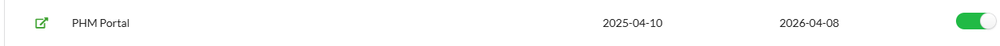

Inform APB : nihiiPharmacyNumber you will use to test (barbara.verboven@apb.be)

## SDK Launch Steps

1.  getLaunchUrl for QuestionnaireType: "***checkpatient***" (Do a checkpatient first so you get all the "popvaxdata". The form will run without this but you will not have any popvaxdata like riskfactors etc. displayed.)
2.  getLaunchUrl for QuestionnaireType: "***phm***"

*See also [PharmForm_PHM](PharmForm_PHM.md)*

## How to Test the Application

To test the application, you can choose from the following 8 Test Patient INSZ:

| Test Patient INSZ | Gender |
| --- | --- |
| 57.01.01-009.01 | M   |
| 57.01.02-075.02 | M   |
| 57.01.03-044.03 | V   |
| 57.01.04-013.04 | M   |
| 57.01.05-079.05 | M   |
| 57.01.06-048.06 | V   |
| 57.01.07-017.07 | M   |
| 57.01.08-083.08 | M   |

We ask you to register the following 2 medications for your chosen test patient and your pharmacy :

- 4782074 - METFORMIN EG 500MG FILMOMH TABL 60
- 1517192 - METFORMAX 850 TABL 40 X 850 MG

This will make your test patient usable to trigger the popvax popup for your pharmacy.

After registering the medications, please wait 24 hours. Following this period, the Popvax should pop up for this patient when doing a “checkpatient” and “phm” .

## Form Info

### Left: Patient

On the left side of the screen you will see the info of the patient (gender, name, lastname, age, birthdate and SSIN nummber) along with the history of dispensations of vaccins in your pharmacy.

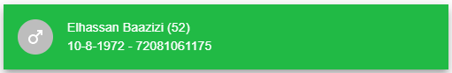
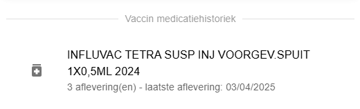

If there are action points, they will be displayed. Two action points are possible: 
* Encourage flu vaccination
* Encourage covid vaccination

  
If there are no action points because someone is not eligible for vaccination, has already been vaccinated, or there is indicated that the patient does not wish to be vaccinated, you will see the message 'no actions required'.
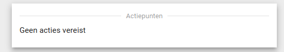

A "PatientRiskCard" in the form of a green bar will also be displayed if there is popvaxdata available for this patient (based on dispenses in your pharmacy). This means that the patient belongs to a risk group for which vaccination is recommended. The icons in the green bar represting the present risk factors for that patient. 

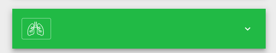

When you hover over an icon with your mouse, the name of the corresponding risk factor will appear.

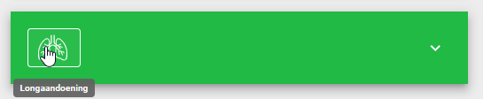

When you expand the section, you will see an overview of all risk factors, with the specific risk factor(s) for the patient highlighted in orange. Below that, you will also see the dispensing history for this patient at your pharmacy, which explains why this risk factor has been assigned to them."

If not there will be a card displayed mentioning the lack of data. 

### Right: Vaccinations

On the right side two tables will be shown. One with all the data for covid and one for flu. 

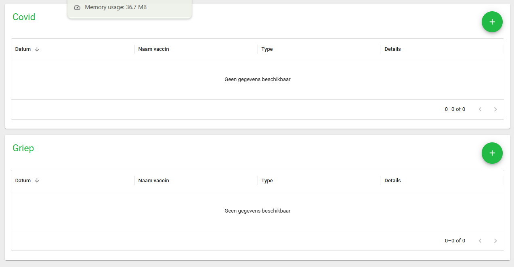

All the vaccin registrations and popvax registrations in your pharmacy but also from other pharmacies and health ceare providers will be displayed. 
All the registrations from your own pharmacy will be light green. All the registrations from other pharmacies and other health care providers will be white.

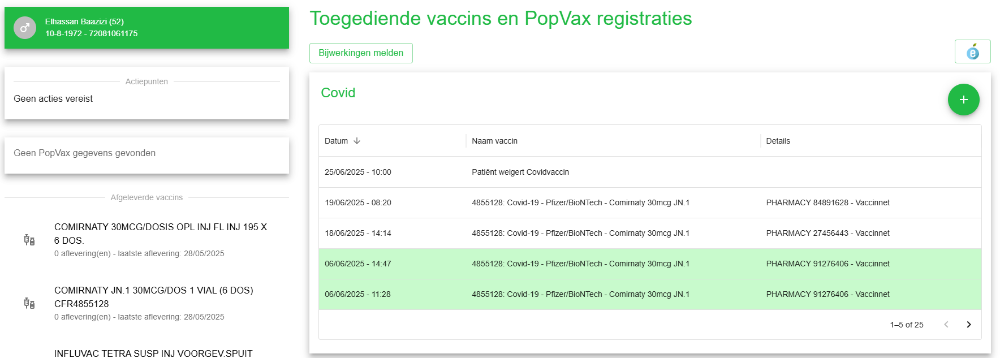

Each card has a green button with a + in it to show a menu containing actions to add vaccinations or other popvax related actions. 

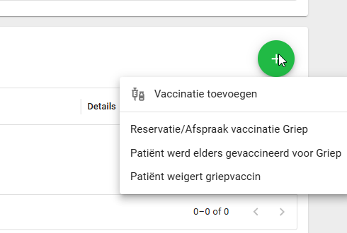

Note that if there is no popvaxdata available for the patient the only available option in the menu will be the "add/register vaccination" option. 

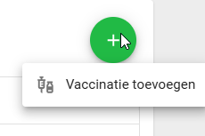

The add/register vaccination option will open the VaccinationRegistration eForm where the vaccindata can be entered and saved. 

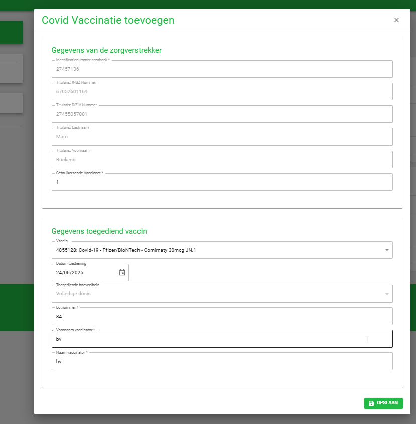

Most of the healthcare provider’s details (pharmacy identification number, INSZ of the titularis pharmacist, RIZIV number of the titularis pharmacist, first name and last name of the titularis pharmacist) are filled in automatically. 
The Vaccinet user code needs to be entered only once. It will then be automatically suggested through caching. 

The details of the administered vaccine must be entered. Depending on which vaccine you want to register, the available COVID or flu vaccines will be displayed automatically. 
The most recently entered batch number, as well as the first and last name of the vaccinator, will also be suggested through caching.

All the other actions will be immediately registered and saved once clicked. Multiple actions can be done during the same session but the new data will not be displayed until the form is restarted for this patient. 

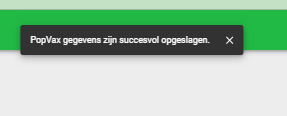

